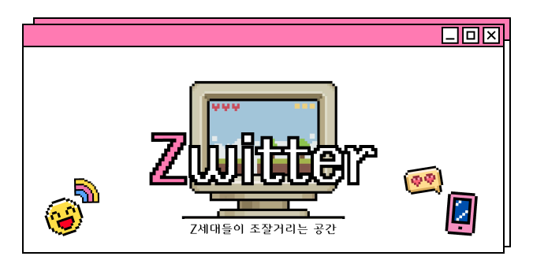
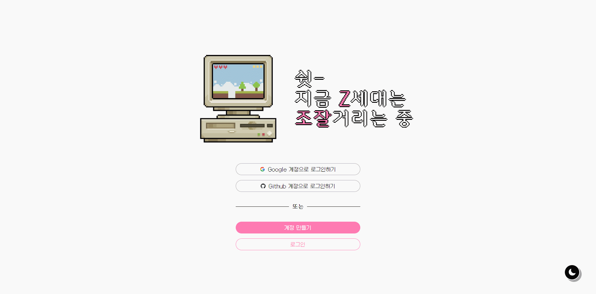
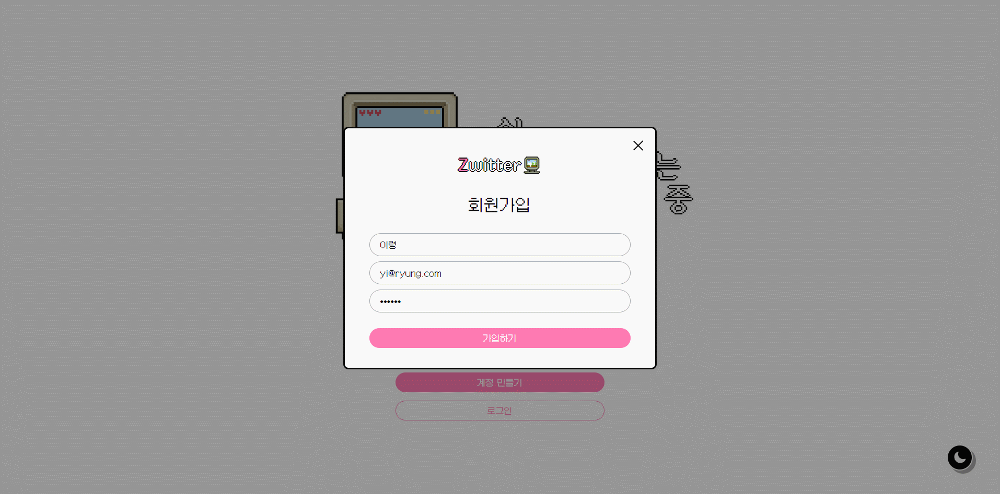

# Zwitter 🍧

<div align="center">

</div>

## 📢 프로젝트 개요

<br>

> 쉿-🤫 지금 Z세대는 **제트위터**에서 조잘거리는 중

실시간 소통 SNS 플랫폼 서비스 프로젝트

초기 '트위터 클론코딩'이라는 목표로 시작해, 사용자들이 실시간으로 소통하고 정보를 공유할 수 있는 독립적인 SNS 플랫폼으로 발전시켰습니다. 사용자들은 자유롭게 글을 남기고 다른 사용자들에게 공감을 남기거나 댓글을 남길 수 있는 기능을 제공합니다.

<br />

## 🏡 [배포](xwitter-c64ef.web.app/)

> [xwitter-c64ef.web.app](xwitter-c64ef.web.app)

<br />

## 🌈 기술 스택

- 언어 : 
- 라이브러리 : 
- 상태 관리 : 
- 스타일링 : 
- 번들링 : 
- 데이터베이스 & 배포 : 
- 디자인 : 
- 형상 관리 : 

<br />

## 🥁 주요 기능 소개

### 📍 로그인 및 회원가입



Firebase의 Authentication을 이용하여 구현된 **로그인 및 회원가입** 창입니다.

회원가입 수단은 총 3가지로 **이메일 / Google 연계 / GitHub 연계** 가 존재합니다. 이메일을 기반으로 회원가입을 진행하거나 Google 및 GitHub 계정을 연동하여 소셜 로그인이 가능합니다.

로그인과 회원가입 폼은 팝업으로 열리며 로그인 성공 시, 다음 화면으로 전환됩니다. 로그인하지 않은 사용자는 해당 페이지 외 다른 페이지로 이동이 불가능합니다.

```tsx
// ProtectedRoute.tsx
export default function ProtectedRoute({
  children,
}: {
  children: React.ReactNode;
}) {
  const user = auth.currentUser; // firebase를 통해 추적한 정상 로그인된 현재 사용자
  const [localStorageUser, setLocalStorageUser] =
    useRecoilState(currentUserAtom); // 전역 데이터로 관리하는 현재 사용자
  if (!user && localStorageUser.userId !== '') {
    return <Navigate to="/auth" />; // 로그인 유저가 없다 경우 로그인/회원가입 페이지로 이동시켜 다른 경로를 보호함
  }
  return children;
}
```

<br />

### 📍 메인 타임라인



작성 중...

<br />
<!-- 
### 📍 좋아요 및 댓글 작성


<br />

### 📍 포스팅 작성


<br />

### 📍 포스팅 수정


<br />

### 📍 포스팅 삭제


<br />

### 📍 프로필


내 프로필 가기 & 상대방 프로필 가기

<br />

### 📍 프로필 수정


내 프로필 사진, 이름 수정하기

<br />

### 📍 포스팅 검색


<br />

### 📍 로그아웃


<br />

### 📍 회원 탈퇴


<br />

### 📍 테마 모드 전환


<br />

### 📍 반응형 레이아웃


<br />

## 💎 성능 최적화

### 🔎 Lighthouse

### 🔎 코드 스플리팅

### 🔎 이미지 최적화

### 🔎 SEO 최적화

<br />

## 🧨 바로 가기

- [프로토타입 디자인]()
- [백로그]()
- [개발 회고]() -->
